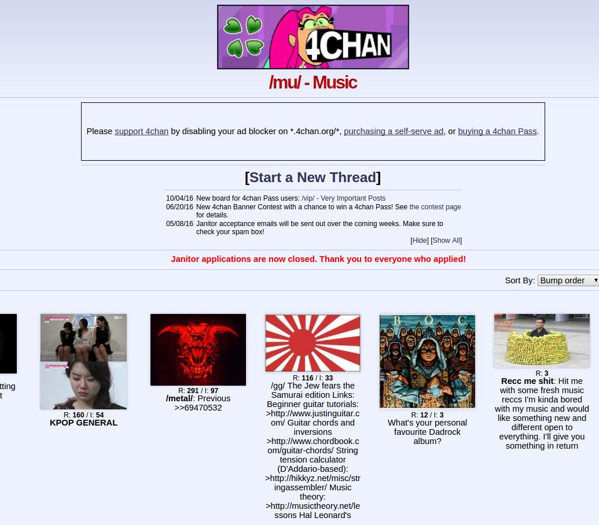
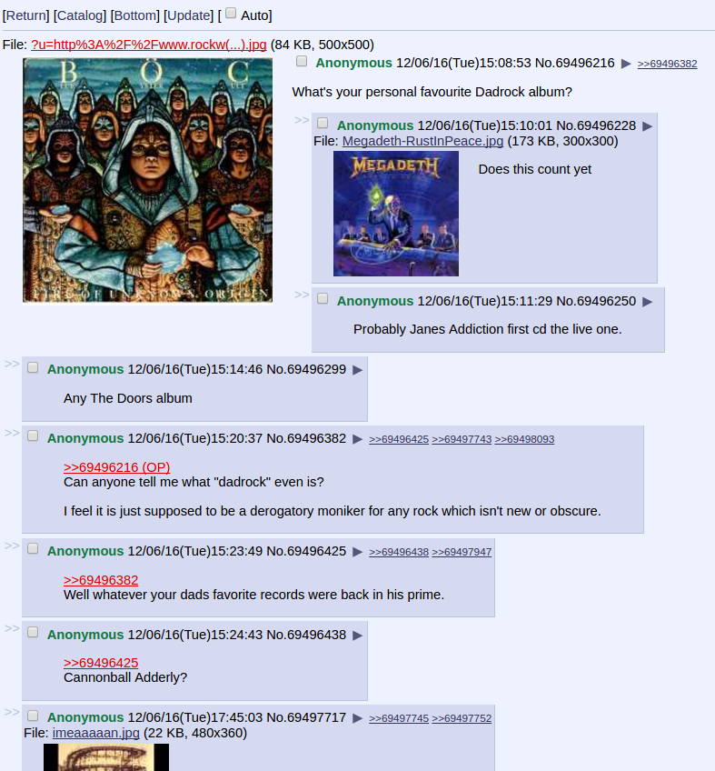
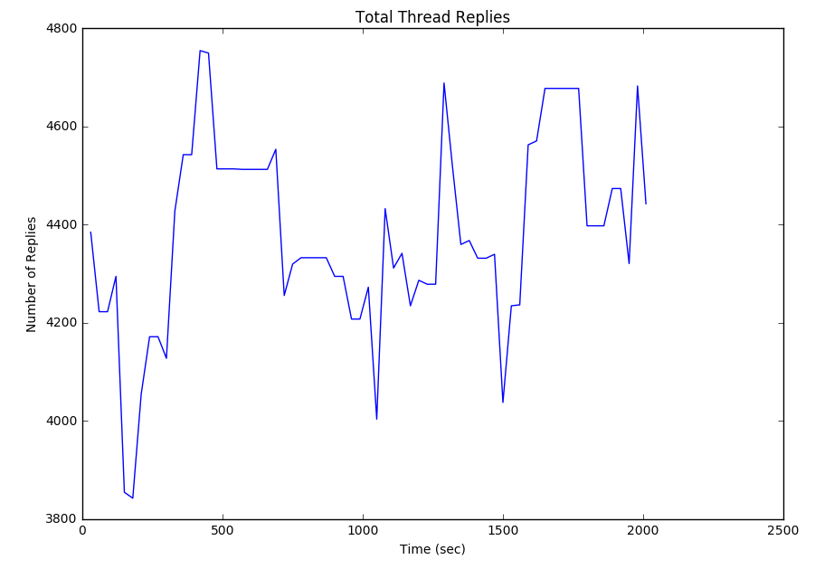
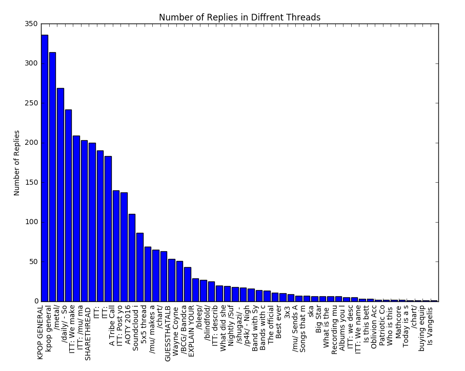
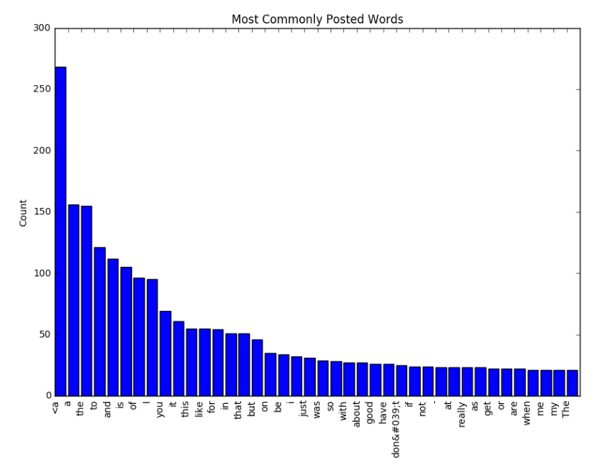

# CITS5503_SparkAnalysis
## Analysis of discussion board messages with Apache Spark.
This project involed using Apache Spark to analyize the statistics of the 4chan/mu Music board to provide 
information about regurally discussed topics and peek discussion times. Apache Spark was used as a high perfomance batch processing tool to efficently extract discussion data. The following instructions shows how to use the program developed.

4chan is an image sharing and discussion forum with boards discussing different topics. /mu/ is 4chan's board for discussing music. Here people talk about music they like and share music with others on discussion threads. The purpose of this project was to abstract data from this board to analyse the most talked about music topics. The most frequently said words and the peak traffic times on the forum.

 

## Data Abstraction
Abstracting the data form the image board involved using its public API which coverts data about board topics, replies, creation date and other information into json format. Using this the program pulls json from the API and converts it to a python object. The data is then manipulated into an array of thread objects, providing information about each discussion thread. This array is then partitioned for a cluster environment using Apache Spark to provide improved analysis through parallelized computation.

## Traffic Analysis 
The traffic on the board is found by analysing the number of recent replies in the threads on the board. The reply count is appended to an array and plotted periodically to show traffic levels on the forum over a period of time.

## Most Popular Thread Analysis
The data is also analysed to provided information on the most popular music threads. This is done by analysing the reply count of each thread using Spark.

## Most Commonly Posted Words
Thread data is also evaluated to find the most commonly posted words in the forum. This is done by extracting words from thread replies and reducing them by key to count their occurrences in threads. The most common words are plotted as shown below.

## Automatically Scheduled Analysis and Plotting
The program uses a scheduled loop to re-analysis the board data after a specified period. This computes the above analysis, providing live information on the discussion activity on the board which automatically updates. The data is then plotted using pyplot as seen above to provided useful statistics about the activity on the image board.

## Usage
## 1. Access Jupyter Server
The program is currently being run on a jupyter notebook server on a AWS ec2 machine.
Access it [Here](http://ec2-35-161-247-49.us-west-2.compute.amazonaws.com:8888/notebooks/Board_Analysis.ipynb).

Or provison your own server by following [this guide](https://medium.com/@josemarcialportilla/getting-spark-python-and-jupyter-notebook-running-on-amazon-ec2-dec599e1c297#.b1bx8jfzy).

## 2. Run and Enjoy Live Statistical Analysis Results
Run the first cell and view the live statistics being plotted in the output.
Change **x_time** to vary the time interval (in seconds) between data processing.
